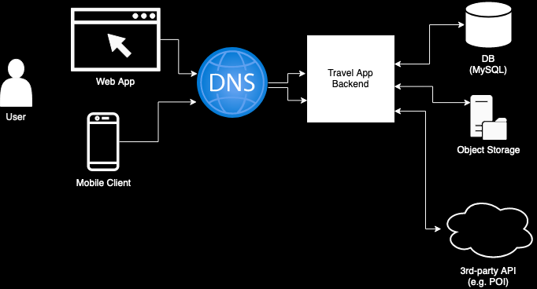

# Hillel Travel App

## Overview
The “Hillel Travel App” is an application where users can document and share their travel experiences. They can mark locations on a map, upload photos, write notes, and share with friends or the public.

The Java backend will manage user profiles, entries, and shared journals. Mapbox (or a similar service) will be used to allow users to pin locations and visualize their travel paths.

## Features
- User Profiles: Register and manage personal profiles.
- Travel Entries: Add new travel experiences with photos, notes, and marked locations on the map.
- Interactive Map: Using Mapbox, allow users to pin their traveled locations and see travel paths.
- Social Sharing: Users can choose to share their entries with friends or the public.
- Search & Explore: Users can explore public entries of other travelers, search for specific locations, and gain inspiration for future travels.
- Comments & Likes: Engage with the community by leaving comments and likes on shared journals.

## Architecture overview
