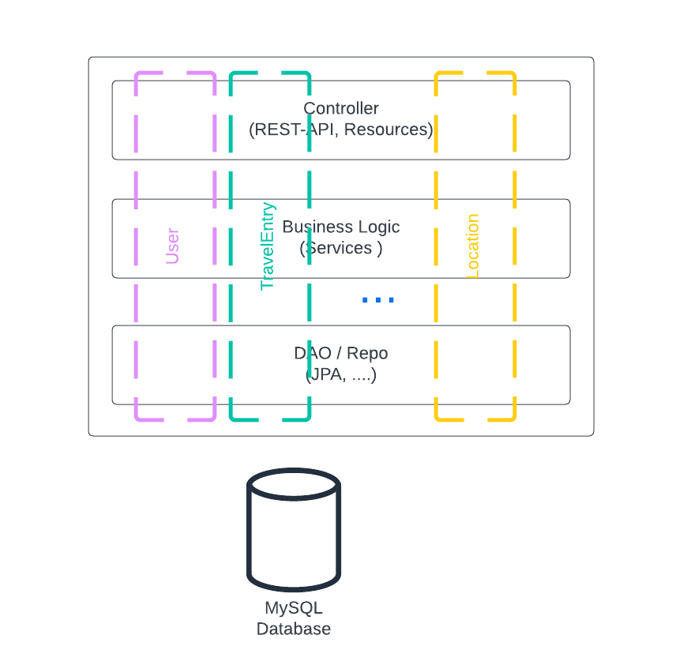

# Hillel Travel App


## Overview
The “Hillel Travel App” is an application where users can document and share their travel experiences. They can mark locations on a map, upload photos, write notes, and share with friends or the public.


The Java backend will manage user profiles, entries, and shared journals. Mapbox (or a similar service) will be used to allow users to pin locations and visualize their travel paths.

## Features
- User Profiles: Register and manage personal profiles.
- Travel Entries: Add new travel experiences with photos, notes, and marked locations on the map.
- Interactive Map: Using Mapbox, allow users to pin their traveled locations and see travel paths.
- Social Sharing: Users can choose to share their entries with friends or the public.
- Search & Explore: Users can explore public entries of other travelers, search for specific locations, and gain inspiration for future travels.
- Comments & Likes: Engage with the community by leaving comments and likes on shared journals.

## Run
Environment variables
```bash
JPA_DB_PASSWORD=<password>
JPA_DB_URL=jdbc:mysql://<host>:<port>/<database>
JPA_DB_USERNAME=<username>
JPA_DRIVER_NAME=<driverName>

JDBC_URL=jdbc:mysql://<host>:<port>/<database>
JDBC_USERNAME=<username>
JDBC_PASSWORD=<password>
```

## Architecture overview
Application implements a full-stack app architecture with separate frontend and backend parts


Frontend can be a webapp, a desktop client or a mobile application

Backend is a monolith Java Application that communicates with a MySQL database, object storage and 3rd-party API

### Backend Entities
- `User` represents actual users that use the app
- `TravelEntry` represents a trip. User can have multiple trips
- `Location` represents a location that belongs to certain trip (`TravelEntry`)
- `Comment` - represents a comment given by a user to a trip (`TravelEntry`)
- `Like` - represents a like given by a user to a trip (`TravelEntry`)


### Entity class diagram
Class diagram that represents entities and relationships between them


### MySQL Schema


### Backend Layers
Backend consists of 3 layers:
- Controller (API, Resources, ...)
- Business Logic (Services)
- Data access (Repo, DAO, ...)


### Backend Domains


### Backend Layers detailed


### Backend data flow
